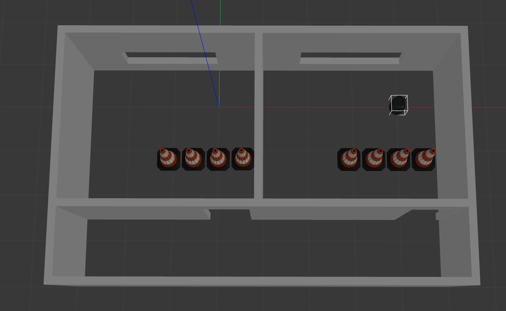

# Projeto Final – Introdução à Robótica

## OBJETIVO

Fazer com que o robô saia da posição (coordenadas x = 0.0 e y = 0.0) em que se encontra em uma das salas e chegue à posição final (coordenadas x = 4.0 e y = 0.0) na sala ao lado de maneira autônoma.  

**Inicial**

**→**

**Final**


## MARCOS DO PROJETO

- **Mapa de ocupação** – Utilizando os dados lidos pelo sensor Kinect (`/camera/depth/image_raw`) ou simplesmente o 2D scan gerado pelo Gazebo (`/scan`), construir um mapa 2D do ambiente. Neste mapa são marcados os espaços livres e ocupados por obstáculos.  
  **Material de apoio:**  
  - [ROS | TurtleBot SLAM [Tutorial]](https://www.youtube.com/watch?v=weUX7lbhsGU)  
  - Para rodar a sequência apresentada neste vídeo, será necessário instalar o pacote `gmapping`:  

    ```bash
    sudo apt-get install ros-noetic-gmapping
    ```

- **Construção do caminho** – Realizar uma pesquisa e posterior escolha de um algoritmo de construção de caminho (path planner).  
  - Campo de Potenciais Artificiais (Artificial Potential Fields): [Robot Motion Planning - Artificial Potential Field Method](https://www.youtube.com/watch?v=Ls8EBoG_SEQ&t=1534s)  
  - A* Pathfinder: [Path Planning - A* (A-Star)](https://www.youtube.com/watch?v=icZj67PTFhc)

- **Controlador** – Projetar o controlador que faça o robô seguir o caminho definido.
